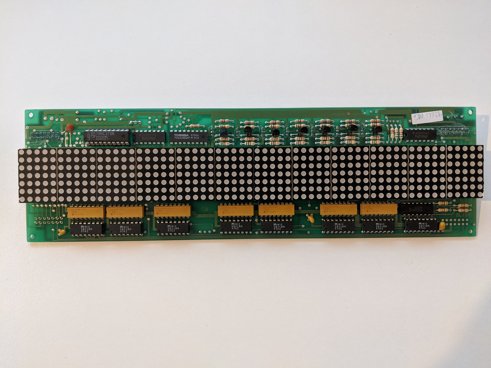

# DL110 LED matrix sign

I recently got a hold of some old DL110 LED panels, this code is a quick implementation of a driver for linux. I've used a Raspberry Pi Zero W to control the panel. See wiring diagram for connection details.

This code is not intended for inexperienced users.

## Usage

Make sure the connections match that in the diagram. The resistors are important to not blow up your pi. The driver chip will otherwise draw too much current. The panel is meant to be driven with 5V logic, but 3.3V works at a little slower speed.

The panel runs at 5V, about 1.5A with all lights on. The power connector is in the top right.

Compile main.c with the appropriate libraries. I used VisualGDB to edit remotely on Visual Studio.

Use the lite version of the Raspbian OS. Any other processing running at the same time will cause artefacts on the display.
